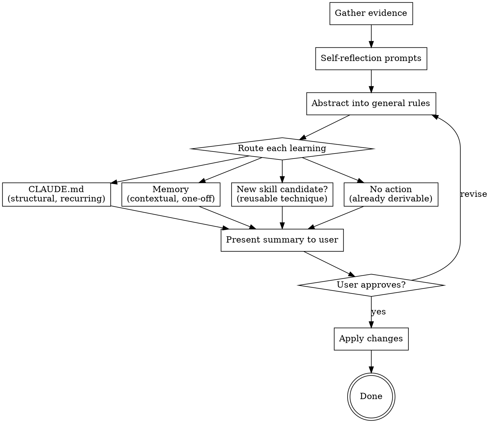

# Retrospective

## Overview

Extract actionable learnings from completed work. The core question: **"What did we discover late that we should have known early?"** Each learning gets abstracted from the specific incident into a general rule, then routed to the right persistence layer.

**Announce at start:** "Running a retrospective on this work to capture learnings."

## When to Use

- After executing-plans + finishing-a-development-branch completes
- After any multi-step implementation session
- When the user explicitly asks to reflect on completed work

## The Process



### Step 1: Gather Evidence

Don't rely on memory — look at what actually happened:
- Read the plan that was executed
- Run `git log --oneline` for commits made during this session
- Scan for reverted commits, fixup commits, or amended messages (signs of wrong-direction work)
- Note the time between plan start and completion per task

### Step 2: Self-Reflection Prompts

For each task or significant commit, ask yourself:
- **"What did I just learn that wasn't obvious before starting?"**
- **"If I faced this exact problem again tomorrow, what would I wish I knew upfront?"**
- **"What error or symptom led me down the wrong path, and what was the actual cause?"**
- **"Did I build something and then redo it? What assumption was wrong?"**
- **"Was there a command, pattern, or convention that would have made this trivial?"**
- **"Did the prompt contract miss something that caused wrong-direction work?"**

### Step 3: Abstract Into General Rules

This is the critical step most retrospectives skip. Don't capture the incident — capture the **general rule** the incident teaches.

| Specific incident | General rule |
|-------------------|-------------|
| "Convex actions can't import node:crypto" | "Convex runs in a browser-like environment — verify runtime compatibility before using Node.js built-in modules" |
| "Spent 20 min finding the right schema file" | "Add a 'where to find things' section to CLAUDE.md when the project has non-obvious file locations" |
| "Mock server didn't match the real API shape" | "When mocking external APIs, validate the mock's response shape against the real API types at build time" |

**The test:** Would this rule help someone who has never seen this specific incident?

### Step 4: Route Each Learning

Each abstracted rule goes to exactly one destination:

| Destination | Criteria | Examples |
|-------------|----------|---------|
| **CLAUDE.md** | Structural, recurring, saves every future session time | Build commands, file conventions, runtime constraints, common gotchas |
| **Memory** (feedback/project type) | Context-specific but useful across sessions | "User prefers X approach", "Project Y uses pattern Z because of constraint W" |
| **Skill candidate** | Reusable technique that required real discovery, not just docs | Non-obvious debugging workflow, multi-step integration pattern |
| **No action** | Already derivable from code, git, or existing docs | Specific debugging steps, one-time fixes |

**Routing rules:**
- **CLAUDE.md only if it would prevent a class of problems**, not just one bug
- **Memory for decisions and context** that explain *why* something is the way it is
- **Skill candidate if the technique is reusable across projects** and required non-trivial discovery
- **When in doubt, use memory.** CLAUDE.md bloat hurts every future session

### Step 5: Present to User

Show a concise summary — do NOT apply changes without approval:

```
## Retrospective — [feature/task name]

### What We Learned Late
- [general rule] — discovered at [step], could have known from [source]. Impact: [minor/significant/major]

### Process Friction
- [what happened] → [what would fix it]

### Proposed Changes
| Learning | Destination | Rationale |
|----------|-------------|-----------|
| [rule 1] | CLAUDE.md | [why it's structural] |
| [rule 2] | Memory (feedback) | [why it's contextual] |
| [rule 3] | Skill candidate | [why it's reusable] |
| [rule 4] | No action | [why it's already covered] |
```

Wait for user approval before writing anything.

### Step 6: Apply

After user approval:
1. Edit CLAUDE.md with approved additions (keep concise, match existing section style)
2. Write memory files with proper frontmatter and update MEMORY.md index
3. For skill candidates: note them for future creation (don't create skills inline — that's a separate workflow)
4. Confirm what was written

## What NOT to Capture

- Things already obvious from reading the code or git history
- Specific debugging steps that only applied to this one bug
- Information that will be stale within days
- Documentation that duplicates what's already in CLAUDE.md or project docs
- Learnings without the abstraction step (raw incidents, not general rules)

## Quality Gates

Before proposing any learning:
- [ ] Abstracted from specific incident to general rule
- [ ] Rule is testable — you can tell if it's being followed or not
- [ ] Not already covered by existing CLAUDE.md, docs, or code comments
- [ ] Routed to exactly one destination with clear rationale

## Red Flags

| Thought | Reality |
|---------|---------|
| "Everything went smoothly, nothing to learn" | Review git log — reverts, fixups, and long gaps between commits tell the real story |
| "This is too minor to capture" | Minor friction repeated 10x becomes major. Capture the pattern, not the incident. |
| "Let me add everything to CLAUDE.md" | CLAUDE.md bloat hurts every future session. Be ruthlessly selective. |
| "No time for retrospective" | 2 minutes now saves 20 minutes next time. This IS the high-leverage work. |
| "The learning is too specific" | You skipped the abstraction step. Go back to Step 3. |
| "I'll remember this next time" | You won't. You're a new instance every session. Write it down or lose it. |
